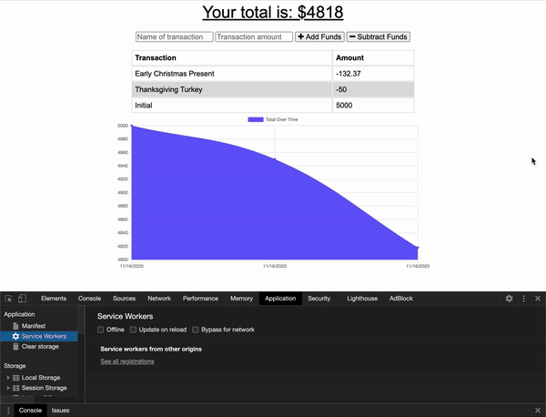

# Budget-Tracker

## Description
This is a budget tracking application that allows users to add transactions online and offline.

## Table of Contents
  1. [Installation](#Installation)
  2. [Usage](#Usage)
  3. [License](#License)
  4. [Contributing](#Contributing)
  5. [Questions](#Questions)

## Installation

No installations required. Visit the deployed application on Heroku: [Budget Tracker](https://nameless-taiga-26219.herokuapp.com/)

## Usage

The user can log their expenses with this Budget Tracker application. To log a new transaction, the user has to fill out the transaction name and amount, then click on either the *+ Add Funds* or *- Subtract Funds* button. The user can see all expenses displayed on the page along with a graph.

## License

Other

## Contributing

Everyone is welcome to contribute. Please see [Questions](#Questions) below for the contact information.

## Questions

Please visit https://github.com/achueng to learn more about the developer and other projects.
  
If there are any question, issues, or concerns, please contact Agnes via email at [agneschueng2020@u.northwestern.edu](mailto:agneschueng2020@u.northwestern.edu).
